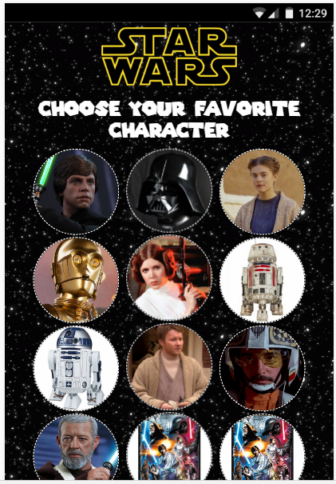

# SWAPI

Proyecto en cual podemos obtener la información de los personajes de Star Wars.

## Desarrollado para 
[Laboratoria](http://laboratoria.la)

### Organizacion del trabajo

* Creando estructura de carpetas respectivamente.
* Indagando y explorando  Swapi.
* Recorriendo json para observar quienes serian los personajes.
* Haciendo maquetado simple con los personajes obtenidos.
* Poniendo estilos relacionados con star wars.
* Trabajando en funcionalidad; obteniendo datos que se mostrara por cada personaje.
* Finalmente el trabajo queda asi:

